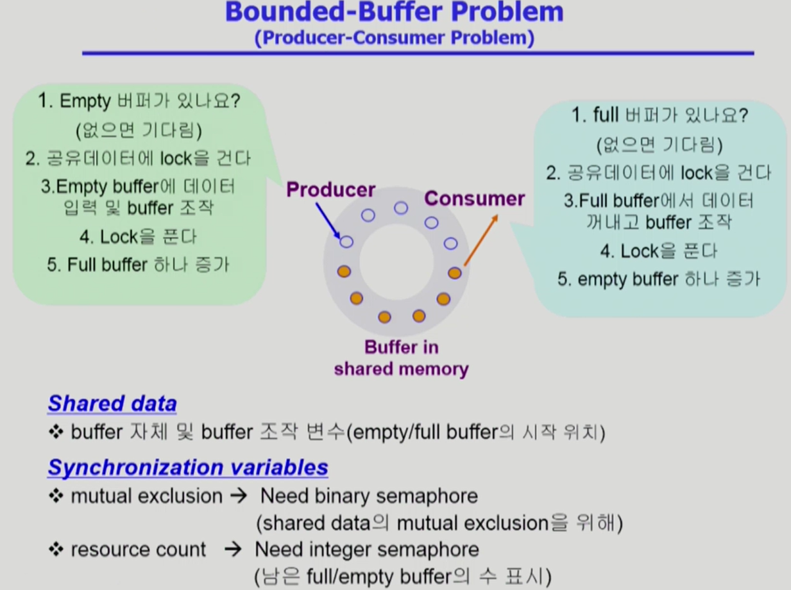
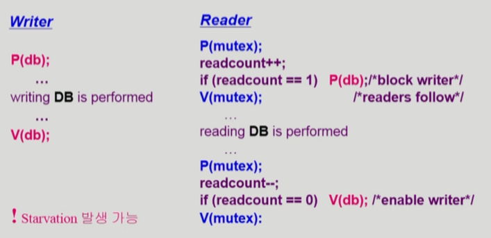
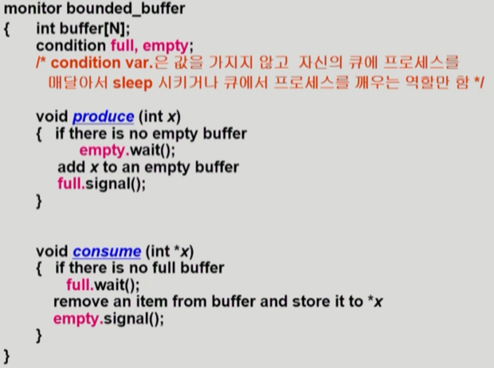

# Synchronization과 관련된 3가지 문제

## 1. Bounded-Buffer Problem (Producer-Consumer Problem)

- Producer(생산자) process 여러개와 Consumer(소비자) process 여러개가 있다.
- 생산자는 공유 버퍼에 데이터를 생성해서 집어넣는 역할. 소비자는 버퍼에서 자원을 꺼내가는 역할.
- 생산자 입장에선 버퍼의 빈 공간이 자원, 소비자 입장에선 버퍼의 데이터가 들어있는 공간이 자원
- 이때 발생할 수 있는 synchronization문제는 두 개의 생산자/소비자가 하나의 버퍼에 있는 데이터에 접근하는 경우에 발생할 수 있는데, lock/unlock 방식으로 해결 가능.
### Shared data
-  buffer 자체 및 buffer 조작 변수(empty/full buffer의 시작 위치)
- 버퍼의 크기가 유한 => 버퍼 공간 크기 이상의 데이터 저장 불가

### Synchronization variables
- mutual exclusion : shared data의 mutual exclusion을 위해 Binary Smaphore변수가 필요함(lock을 걸기 위한 값)

- resouce count : 남은 full/empty buffer의 수를 표시하기 위해 Integer semaphore변수가 필요함
### Logic
**Producer**
- P(empty) - 빈 버퍼가 있는지 확인, 없다면 기다림
- P(mutex) - 버퍼에 데이터를 넣기 위해 버퍼에 lock
- V(mutex) - 버퍼에 걸었던 lock을 푼다
- V(full) - 내용이 들어있는 버퍼의 개수를 1 증가

**Consumer**
- P(pull) - 내용이 들어있는 버퍼가 있는지 확인, 없다면 기다림
- P(mutex) - 버퍼에 데이터를 넣기 위해 버퍼에 lock
- V(mutex) - 버퍼에 걸었던 lock을 푼다
- V(empty) - 비어있는 버퍼의 개수를 1 증가

## 2. Readers - Writers Problem
Read process들과 Write process 들로 두 종류의 프로세스가 있다.   

- 한 process가 DB에 write 중일 때 다른 process가 접근하면 안됨
- read는 동시에 여럿이 해도 됨
- solution
	- writer가 db에 접근 허가를 아직 얻지 못한 상태에서는 모든 대기중인 reader들을 다 db에 접근하게 해준다.
	- writer는 대기중인 reader가 하나도 없을때 db에 접근이 허용
	- 일단 writer가 db에 접근중이면 reader들은 접근이 금지
	- writer가 db에서 빠져나가야만 reader의 접근이 허용
### Shared data
- DB  그 자체
- readcount : 현재 DB에 접근 중인 Reader의 수
###  Synchronization variables
- mutex : 공유 변수 readcount를 접근하는 코드(critical section)의 mutual exclusion을 보장하기 위해 사용
- db : reader와 writer가 공유db 자체를 올바르게 접근하게 하는 역할

### Logic

**Writer**
- DB는 데이터 그 자체이고, db는 DB에 대한 semaphore에 해당
- P(db) : 공유 데이터에 lock을 걸어 다른 프로세스가 접근 못하게 하기
- V(db) : lock을 풀어줌

**Reader**
- 읽을 때 lock을 걸긴 한다. 이건 다른 reader를 막기 위한 장치가 아니라 writer가 접근하지 못하도록 하기 위해서!!
- P(mutex) : readcount가 공유 변수이기 때문에 두개의 reader가 동시에 들어오게 되면 readcount가 제대로 증가 되지 않을 수 있기 때문에 우선 lock을 건다. readcount를 1 증가시키고 V(mutex)를 실행해서 lock을 푼다.
- 위 로직은  **writer의 Starvation** 발생 가능.
## 3. Dining-Philosophers Problem(식사하는 철학자 문제)
5 명의 철학자는
1. 밥을 먹거나,
2. 생각을 한다.
밥을 먹을때는 자신의 양 옆에있는 젓가락을 사용해서 밥을 먹을 수 있고, 생각을 할 때는 젓가락을 내려놓는다.

### 앞의 solution의 문제점
- deadlock의 가능성이 있다.
- 모든 철학자가 동시에 배가 고파져 왼쪽 젓가락을 집어버린 경우
### 해결방안
- 4명의 철학자만이 테이블에 동시에 앉을 수 있도록 한다.
- 젓가락을 두 개 모두 집을 수 있을 때에만 젓가락을 집을 수 있게 한다.(아래 로직은 semaphore 초기값이 0으로 헷갈릴 수 있다.)

- 비대칭 : 짝수(홀수) 철학자는 왼쪽(오른쪽) 젓가락부터 집도록 한다.(젓가락의 우선순위 부여)
##  Monitor
### Semaphore의 문제점
- 코딩하기 힘들다
- 정확성(correctness)의 입증이 어렵다
- 자발적 협력(volutary cooperation)이 필요하다
- 한번의 실수가 모든 시스템에 치명적 영향
### => **Monitor**
동시 수행 중인 프로세스 사이에서 abstract data type의 안전한 공유를 보장하기 위한 high-level synchronization construct.

모니터는 공유 데이터를 모니터 내부에 선언해 놓고,
공유 데이터에 접근하기 위해서는 **모니터 내부의 프로시저를 통해서만 내부 데이터에 접근**할 수 있게 해 놓음

모니터는 원천적으로 동시에 여러 프로세스가 접근이 안되도록 한다.
=> **lock을 걸 필요가 없다!**  다른 프로세스들은 모니터 외부에서 줄 서서 기다린다.

- 모니터 내에서는 한번에 하나의 프로세스만이 활동 가능
- 프로그래머가 동기화 제약 조건을 명시적으로 코딩할 필요가 없음
- 프로세스가 모니터 안에서 기다릴 수 있도록 하기 위해 condition variable 사용 condition x, y
- condition variable: wait 와 signal 연산에 의해서만 접근 가능
	- x.wait(); : w.wait을 invoke한 프로세스는 다른 프로세스가 x.signal()을 invoke 하기전까지 suspend 된다.
  - x.signal(); : x.signal()은 정확하게 하나의 suspend 된 프로세스를 resume 한다. suspend(잠들어 있는)된 프로세스가 없으면 아무일도 일어나지 않는다.

### Bounded-Buffer Problem
아까 위에서 봤던 생산자-소비자 문제의 semaphore 코드를 monitor 코드로 변환한 것

- 공유 버퍼가 모니터 안에 정의되어 있음
- 생산자, 소비자 함수가 모니터 내부에 정의되어 있다.
- signal 연산이 하는 역할은 대기 중인 프로세스를 깨워주는 역할
- void produce() : 만약 비어있는 버퍼가 있다면 버퍼에 x 값을 넣고 full에 신호를 준다. 
만약 비어있는 버퍼가 없다면 empty에서 기다린다.
- void consume(): 위의 함수와 반대로 동작한다.
	만약 값이 채워져있는 버퍼가 있다면 버퍼에 x 값을 빼서 소비한다. 	그리고 empty에 신호를 준다.
만약 값이 채워져있는 버퍼가 없다면 full에서 기다린다.
- semaphore변수를 사용하는 코드에서는 lock/unlock을 해주는 코드가 있었지만 monitor 코드에서는 별도로 두지 않아도 된다.
